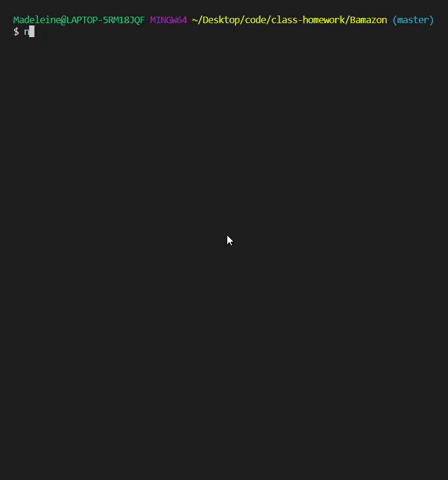
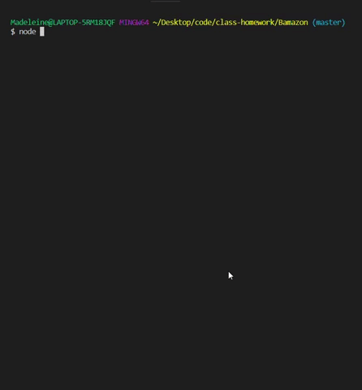
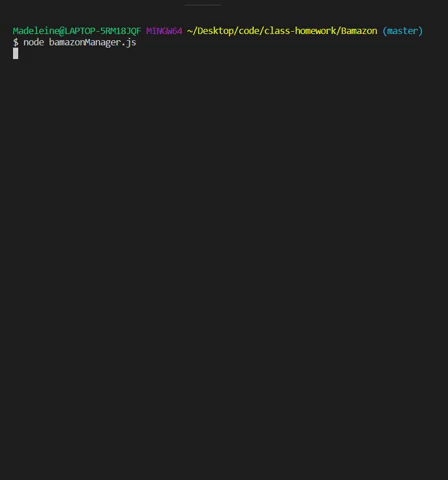

# Bamazon
A CLI app to take orders from customers and deplete stock. Uses MySQL and Node.js

## Description

A simple command line storefront with two main functions:  

* Customer: Allows user to view and purchase products.
* Manager: Allows user to view products, update stock, add a new product, and view products with low inventory. 

## Technologies Used  
* Javascript
* Node.js
* MySQL
* NPM Packages:
  - mysql
  - inquirer

## Usage

### Customer Demo

### Manager Demos

#### Viewing All Products

#### Viewing Low Products

#### Adding Stock

#### Adding a New Product

